C++ Movie_Reservation Program
===

영화 예매 프로젝트

- 핵심 목표: 학교에서 했던 프로젝트를 완벽한 프로그램으로 만들자!!
- Keyword: C++, MFC, Socket, Access, Document-View Structure, etc ...

> Readme 작성중...

 

샘플 화면
---
개발 환경이 윈도우에서 개발하였기 때문에 윈도우 운영체제 실행 하시는걸 추천 권장합니다.

| 유저 로그인 | 관리자 로그인 |
|:----------------------------------------:|:-----------------------------------------:|
|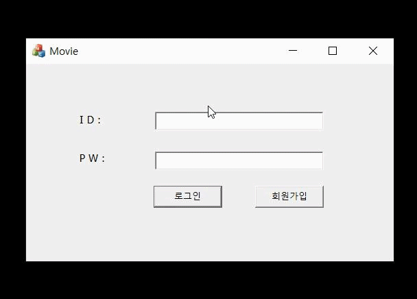|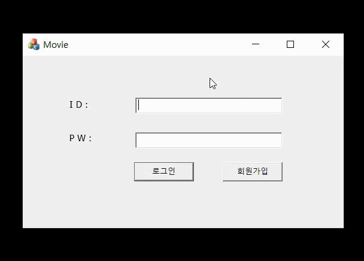|

| 회원가입 | 영화등록 |
|:----------------------------------------:|:-----------------------------------------:|
|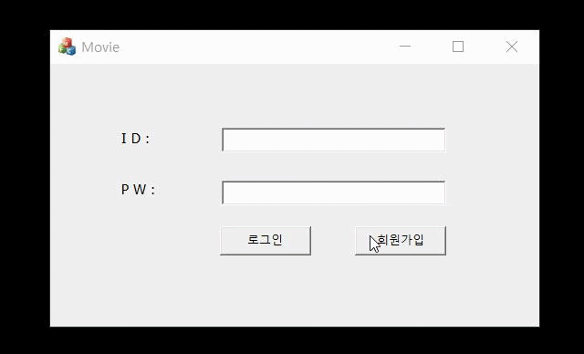|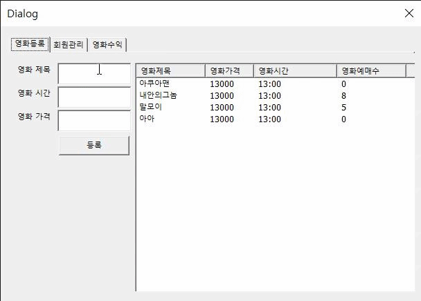|

| 회원관리 | 영화 수입 확인 |
|:----------------------------------------:|:-----------------------------------------:|
|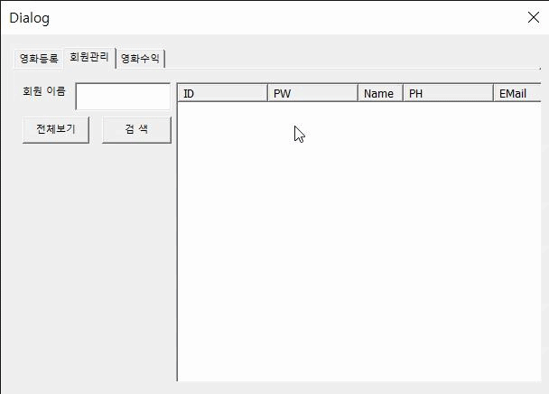|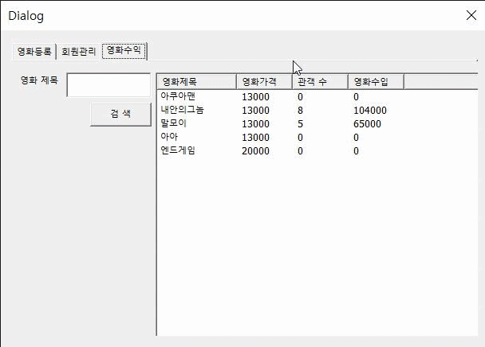|

| 영화예매, 좌석선택 | 인기순위 |
|:----------------------------------------:|:-----------------------------------------:|
|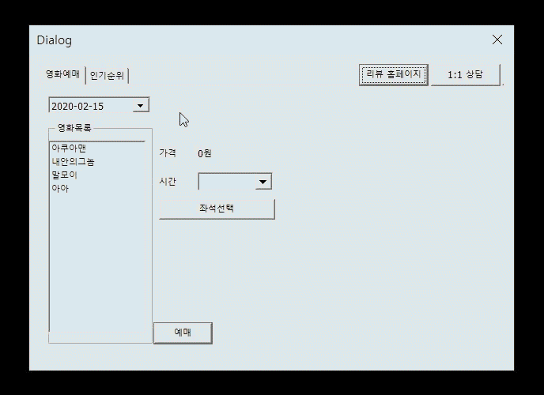|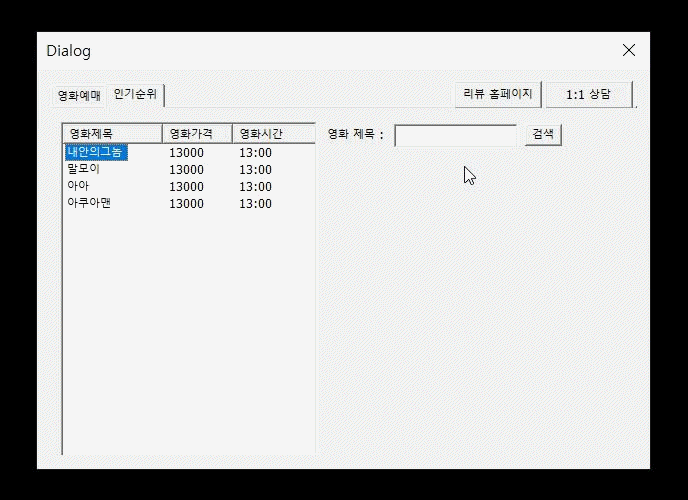|

| 리뷰 페이지 | 고객상담 |
|:----------------------------------------:|:-----------------------------------------:|
|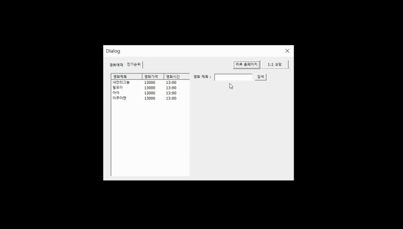|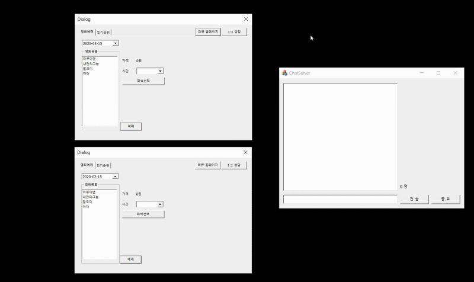|

 

제공 기능에 관하여
---
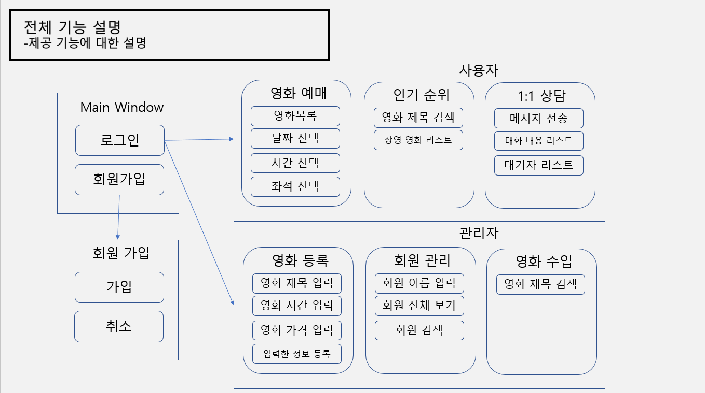

 

UI 흐름 파악을 위한 대략적인 순서도(flowchart)
---
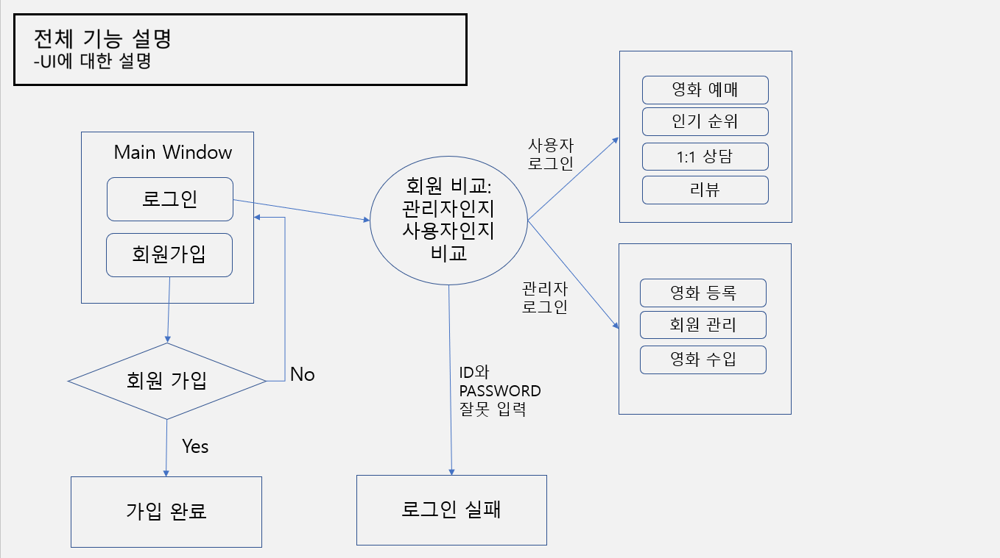

 

ACCESS(DATABASE) 데이터 관리 방안
---
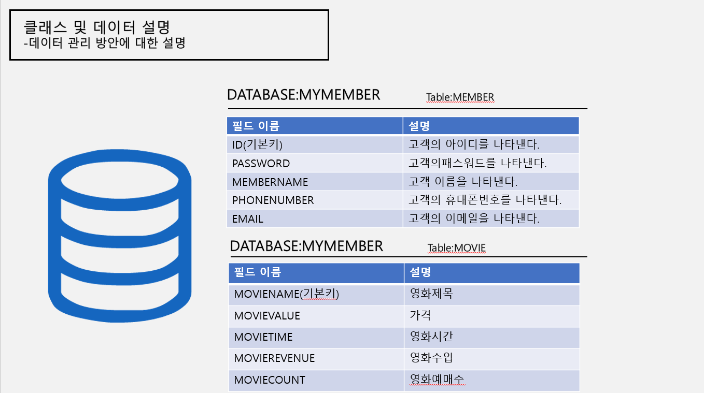

 

클래스별로 알아보는 Document-View 구조
---
프로그램에서 사용할 데이터를 관리하는 부분과 이 데이터를 실제로 화면에 표시하는 부분을 서로 다른 모듈로 구현한다는 개념입니다.

- Document
  - 데이터를 관리하는 기능을 구현한 클래스입니다.
  - 데이터를 저장하거나 읽어 들입니다.
  - 데이터의 변경 사항이 생기면 뷰의 화면을 갱신합니다.

- View
  - 데이터를 화면에 표시하는 기능을 구현한 클래스입니다.
  - 데이터를 화면에 표시합니다.
  - 사용자와 상호 작용을 담당합니다.

| DlgJoin | MovieDlg |
|:----------------------------------------:|:-----------------------------------------:|
|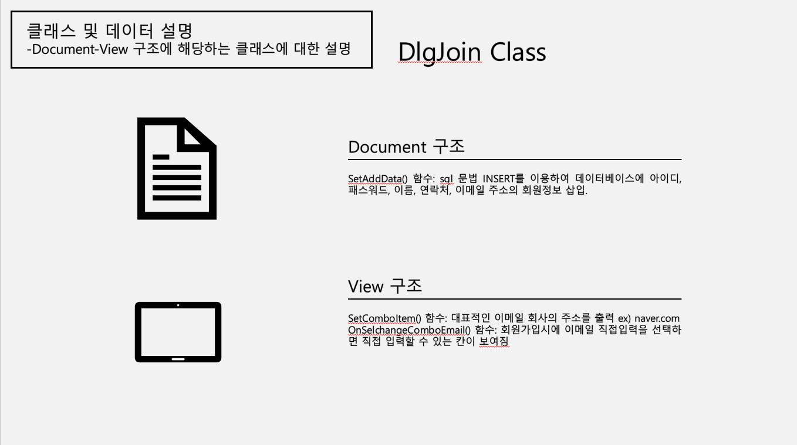|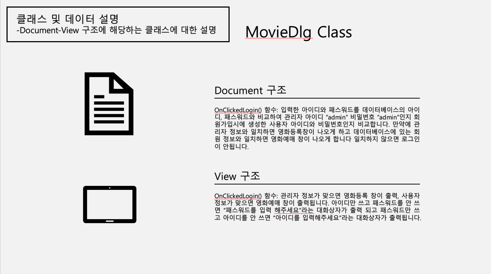|

| DlgRegistration | DlgReservation |
|:----------------------------------------:|:-----------------------------------------:|
|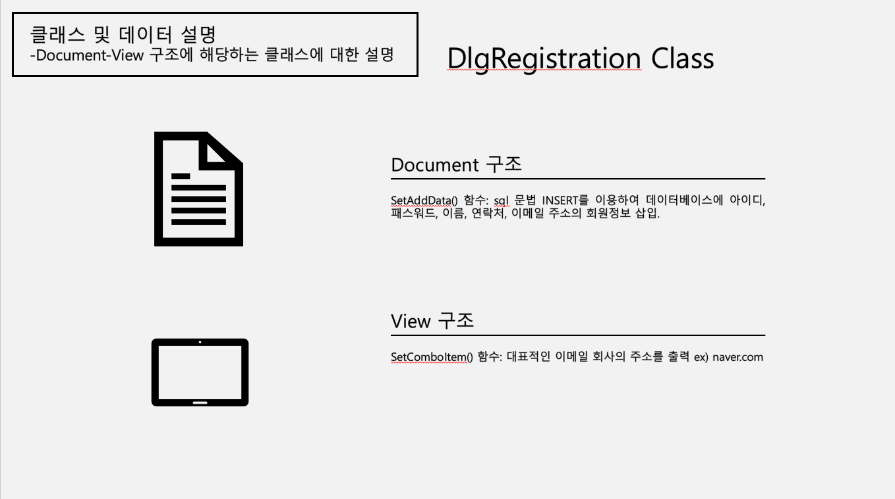|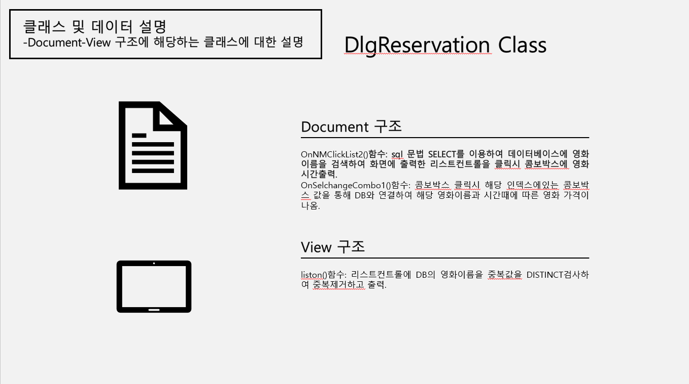|

| DlgRank | DlgManagement |
|:----------------------------------------:|:-----------------------------------------:|
|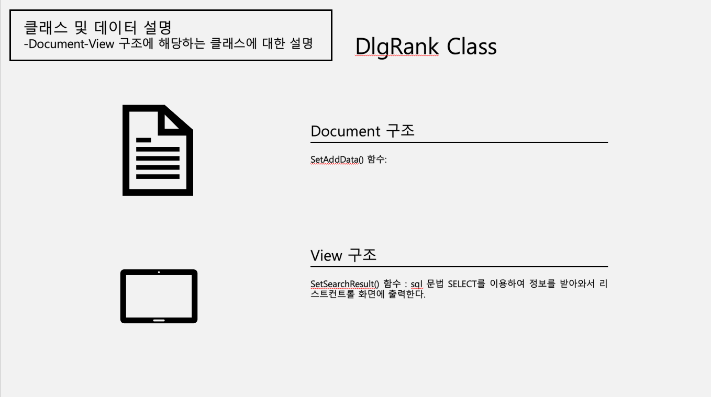||

| DlgImportation | Tab |
|:----------------------------------------:|:-----------------------------------------:|
|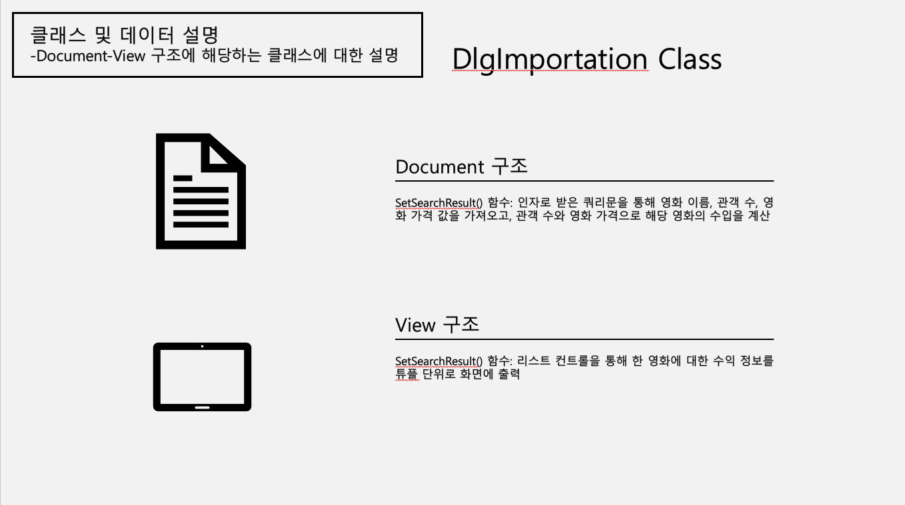|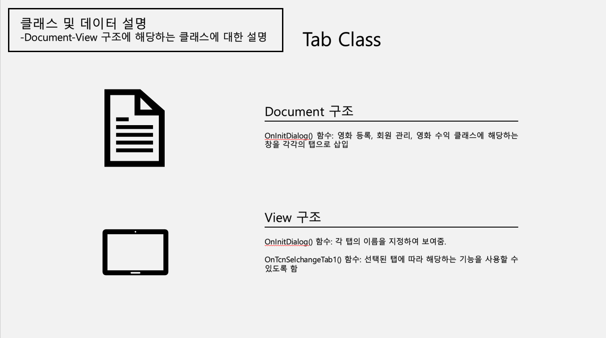|

| Tab1 |
|:----------------------------------------:|
|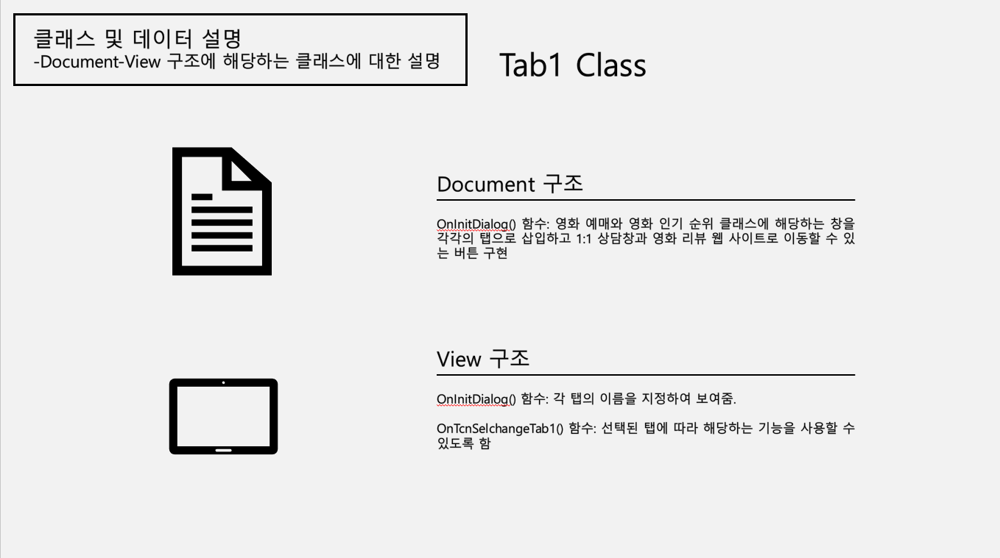|

 

어떻게 실행하나요?
---
- [Microsoft Access 데이터 베이스 사용하기 위해서 ODBC 원본 데이터 설정하기](markdown/index/AccessDB.md)
  - MYMEMBER.mdb에서 데이터베이스 필드들을 편집할 수 있습니다.

- ChatServer 먼저 실행 시켜야 1:1 고객상담 기능이 작동됩니다.

  * * *
  
> [여러 오류사항 문제와 해결법](markdown/index/Error.md)

##### ※ 프로그램 실행 순서 ※ 
  
-> Customer_Consultation_Server\ChatServer.sln

-> Movie_Reservation\Movie.sln

맺으며
---
- MFC로 개발할 때 잡버그와 오류 해결이 가장 힘들었다 ㅠㅠ
- 오류가나면 출력 log를 자세히 읽어보거나 구글링하면 답이 나온다!!
- 아직 부족한게 많은 프로젝트입니다. 재미로 봐주시면 감사하겠습니다^^

License
---
This is released under the MIT license. See [LICENSE](LICENSE) for details.
