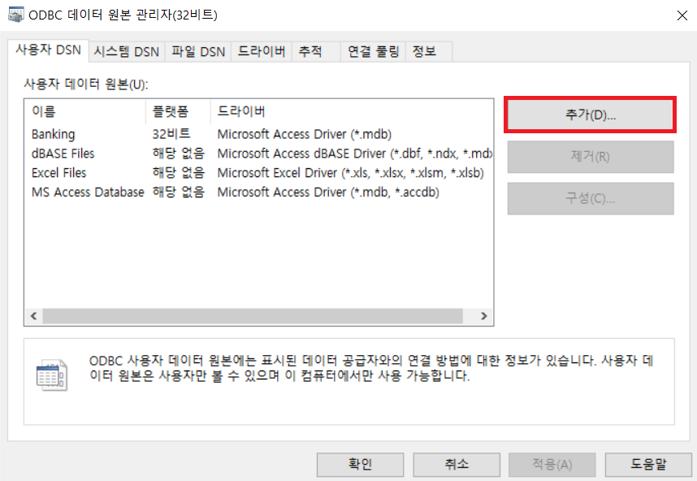
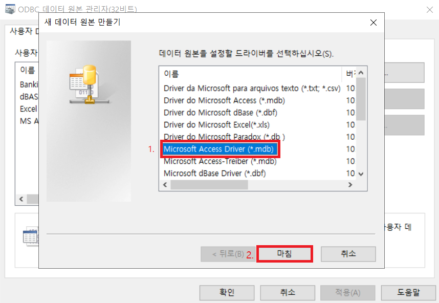
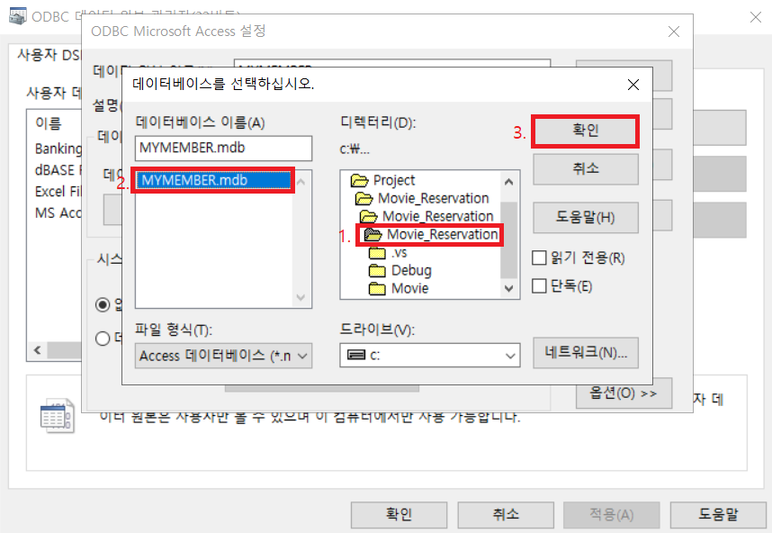
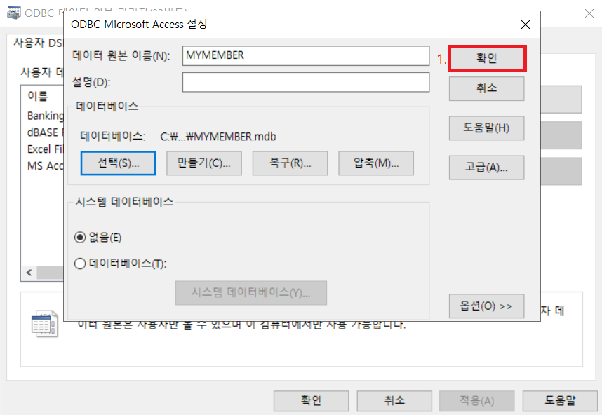
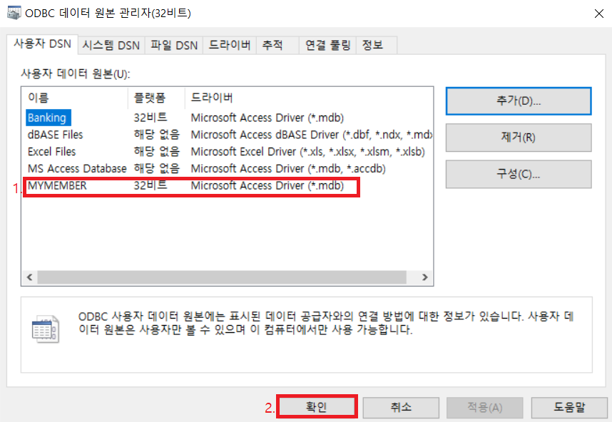

ODBC 원본 데이터 설정하기
---
- Access는 Office365를 설치하면 PowerPoint, Word 등과 Access가 같이 설치 됩니다. 파워 포인트와 워드 등을 보통 필수로 사용하고 있어서 Access도 기본적으로 깔려있다고 본다.
- Access 데이터베이스를 MFC와 연동하기 위해서는 ODBC 설정에서 데이터 원본을 만들어 주어야 합니다.

 

# 1. 윈도우 환경 설정하기
- 제어판 -> 관리 도구 -> ODBC Data Sources (32-bit) 으로 들어갑니다.

- 추가버튼을 누릅니다.

- Microsoft Access Driver를 클릭하고 마침을 누릅니다.

 

- 데이터 원본 이름을 적고 선택을 눌러줍니다. 주의!! 오른쪽 사진에서 Access 파일 이름과 데이터 원본 이름이 다르면 '데이터 원본 이름이 없고 기본 드라이버를 지정하지 않았습니다.'라는 오류가 나옵니다. 꼭!! 쓰고자하는 Access 파일 이름을 같게 설정할것!!!

- Movie_Reservation 폴더를 클릭하면 왼쪽에 mdb 파일이 보입니다. 확인 버튼을 눌러 적용 해줍니다.

- 확인 버튼을 눌러줍니다.

- ODBC 원본 데이터가 정상적으로 만들어졌으므로 확인 버튼을 누릅니다, ODBC로 MS Access mdb 파일을 MFC와 연동할 준비가 되었습니다.

