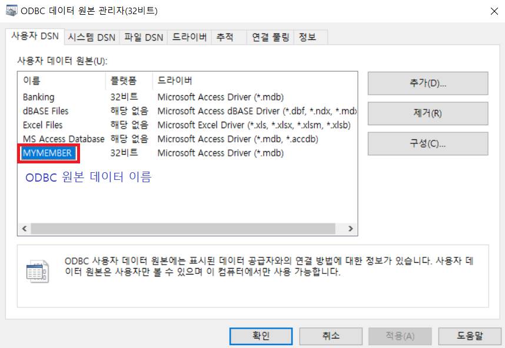
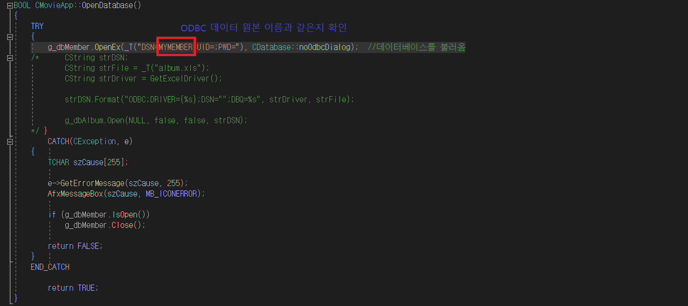

에러 문제와 해결법
===
오류1 : 데이터 원본 이름이 없고 기본 드라이버를 지정하지 않았습니다.
---

해결법
***

 

* 프로그램에서 지정한 ODBC로 연결할 때 DSN으로 데이터를 찾고 DBQ로 경로를 찾아 연결하기 때문에 컴퓨터에서 만들어 놓은 ODBC 원본 데이터와 코드상의 연결할 원본 데이터의 이름이 다르면 에러가 나옵니다.
* ODBC 원본 데이터 이름과 코드상의 연동하고자하는 원본 데이터 이름이 같은지 확인 해봅니다.
